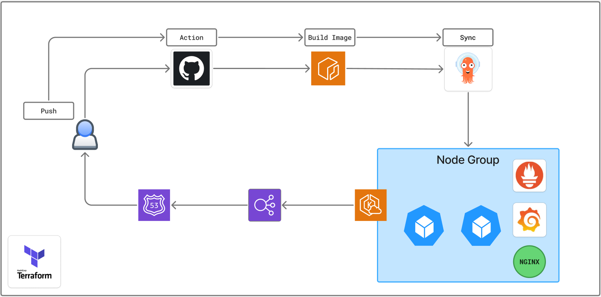
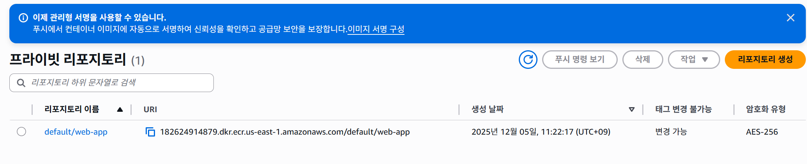
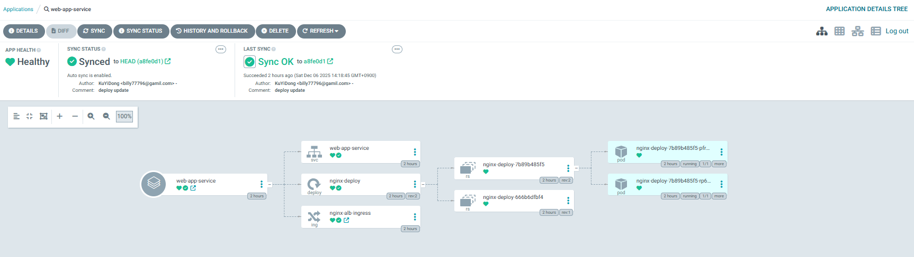
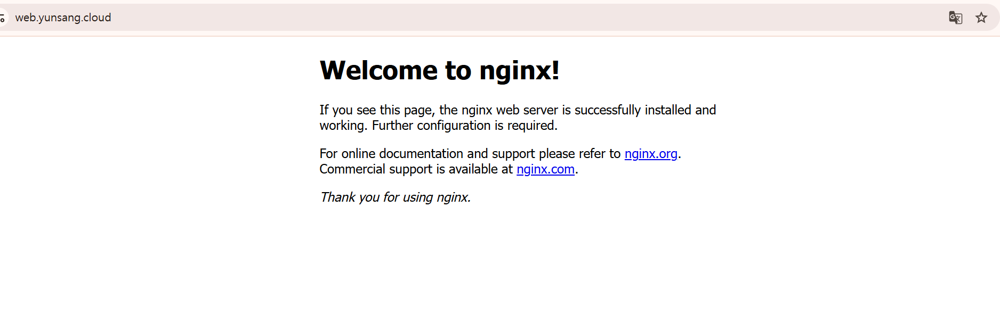
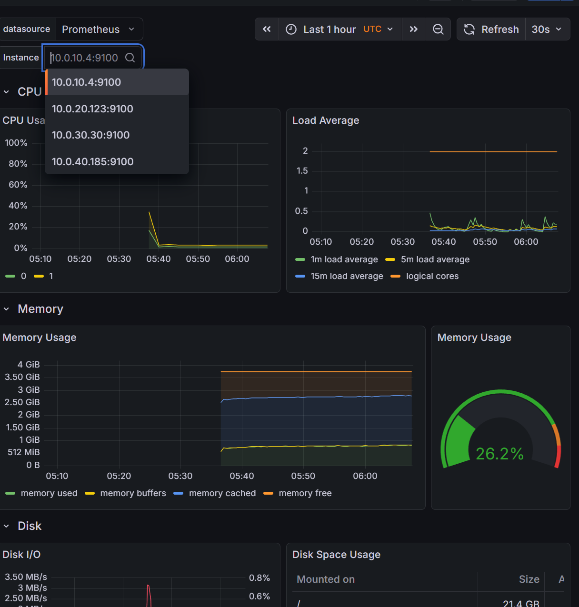

# AWS 인프라 & CI/CD 프로젝트 포트폴리오



------------------------------------------------------------------------

##  <프로젝트 개요>

본 프로젝트는 **Terraform**, **Amazon EKS**, **ArgoCD**, **GitHub
Actions**, **Prometheus/Grafana**를 활용해\
**완전 자동화된 Kubernetes 기반 클라우드 인프라 & CI/CD 환경**을 구축한
내용입니다.

### 주요 특징

-   **IaC(Terraform)** 로 VPC, Subnet, Routing, EKS 클러스터 전체 자동
    구축\
-   **GitOps(ArgoCD)** 로 지속적인 배포 자동화\
-   **GitHub Actions → ECR → EKS** 자동 배포 파이프라인 구성\
-   **Prometheus + Grafana** 를 통한 모니터링 환경 구축\
-   **ALB Controller + EBS CSI Driver** 로 실 서비스 운영을 위한 AWS
    네이티브 구성

⚠️ 완전 자동화가 아니므로 ArgoCD 및 일부 리소스는 README의 수동 설정
지침을 따라 적용해야 합니다.

------------------------------------------------------------------------

## 디렉토리 구조

| 디렉토리 | 설명 |
|----------|-------|
| **Web_app_CI_CD/** | Nginx 기반 Deployment + CI/CD용 매니페스트 |
| **ingress/** | ArgoCD / Grafana / Prometheus Ingress 설정 |
| **kube-prometheus-stack/** | Helm 기반 Prometheus·Grafana 모니터링 스택 |
| **terraform_project/** | VPC, 서브넷, 라우팅, EKS 클러스터 Terraform 코드 |


------------------------------------------------------------------------

<br><br>
<br><br>
<br><br>

# Step By Step

---

<br>

## 1. Terraform 인프라 배포

``` bash
cd eks_project/terraform_project/env/prod/
terraform init
terraform plan
terraform apply
```

------------------------------------------------------------------------

<br><br>

## 2. ALB Controller & EBS CSI Driver 설치

### 2.1 ALB Controller 설치

**① IAM Policy 생성**

``` bash
curl -O https://raw.githubusercontent.com/kubernetes-sigs/aws-load-balancer-controller/v2.14.1/docs/install/iam_policy.json

aws iam create-policy \
  --policy-name AWSLoadBalancerControllerIAMPolicy \
  --policy-document file://iam_policy.json
```

**② IAM ServiceAccount 생성**

``` bash
eksctl utils associate-iam-oidc-provider --cluster $Cluster --approve

eksctl create iamserviceaccount \
  --cluster=$Cluster \
  --namespace=kube-system \
  --name=aws-load-balancer-controller \
  --role-name AmazonEKSLoadBalancerControllerRole \
  --attach-policy-arn=arn:aws:iam::$Account:policy/AWSLoadBalancerControllerIAMPolicy \
  --approve
```

**③ 생성 확인**

``` bash
kubectl get sa aws-load-balancer-controller -n kube-system -o yaml | grep role-arn
```

**④ Helm 설치**

``` bash
helm repo add eks https://aws.github.io/eks-charts
helm repo update

helm install aws-load-balancer-controller eks/aws-load-balancer-controller \
  -n kube-system \
  --set clusterName=$Cluster \
  --set serviceAccount.create=false \
  --set serviceAccount.name=aws-load-balancer-controller \
  --set region=ap-northeast-2 \
  --set vpcId=$(aws eks describe-cluster --name $Cluster --query "cluster.resourcesVpcConfig.vpcId" --output text)
```

------------------------------------------------------------------------

### 2.2 EBS CSI Driver 설치

**① IAM Role 생성**


**② 신뢰관계 정책 수정**


``` json
"aud": "sts.amazonaws.com",
"sub": "system:serviceaccount:kube-system:ebs-csi-controller-sa"
```

**③ EBS CSI Driver 설치**


------------------------------------------------------------------------
<br><br>

## 3. CI/CD 파이프라인 구축

### 3.1 GitHub Repo 생성 & Secret 등록

### 🔐 GitHub Secrets 추가

- 아래에 항목들을 repo안에 secret으로 설정해준다
- repo안에서 Setting -> Secrets and variables 에서 Repository secrets 설정 진행
 -   AWS_ACCESS_KEY_ID\
 -   AWS_SECRET_ACCESS_KEY\
 -   AWS_REGION\

------------------------------------------------------------------------

### 3.2 GitHub Actions Workflow 작성

`.github/workflows/main.yml` 생성\
ArgoCD Sync URL은 본인 설정에 맞춰 변경

    https://<argocd-url>/api/v1/applications/test/sync

------------------------------------------------------------------------

### 3.3 ECR Repository 생성



-   GitHub Actions → Docker Build → ECR Push\
-   ArgoCD가 Git 변경 감지 후 자동 Sync하여 배포

------------------------------------------------------------------------
<br><br>

## 4. ArgoCD 설치 & 설정

### ① Helm 설치

``` bash
helm repo add argo https://argoproj.github.io/argo-helm
helm repo update

helm install argocd argo/argo-cd -n argocd
```

### ② HTTPS 비활성화

``` bash
kubectl edit configmap argocd-cmd-params-cm -n argocd
```

``` yaml
data:
  server.insecure: "true"
```

### ③ Repository & Application 등록

-   GitHub Repo(HTTPS) 연결\
-   ID + PAT Token 입력\
-   Application 생성 후
    -   Namespace 지정\
    -   매니페스트 경로 지정

------------------------------------------------------------------------

<br><br>

## 5. Monitoring (Prometheus + Grafana)

### ① Helm 설치

``` bash
helm repo add prometheus-community https://prometheus-community.github.io/helm-charts
helm repo update

helm install prometheus prometheus-community/kube-prometheus-stack -n monitoring -f prometheus-values.yaml
```

※ CRD 충돌 문제 때문에 **ArgoCD로 설치 금지**\
(반드시 직접 Helm으로 설치)

### ② Ingress 적용

``` bash
kubectl apply -f grafana-ingress.yaml
```

------------------------------------------------------------------------

## 프로젝트 마무리
**[git Action log]**


---

**[Argocd Syn 성공]**



---

**[Web 접속]**



---

**[Grafana]**



Terraform → EKS → GitHub Actions → ECR → ArgoCD → Monitoring\
모든 구성이 서로 연결되는 형태로 실제 회사에서도 그대로 사용 가능한
**Production-Level 구조**입니다.

필요하면: - 아키텍처 다이어그램 다시 제작\
- main.yml 자동 생성\
- full infra 코드도 구성
