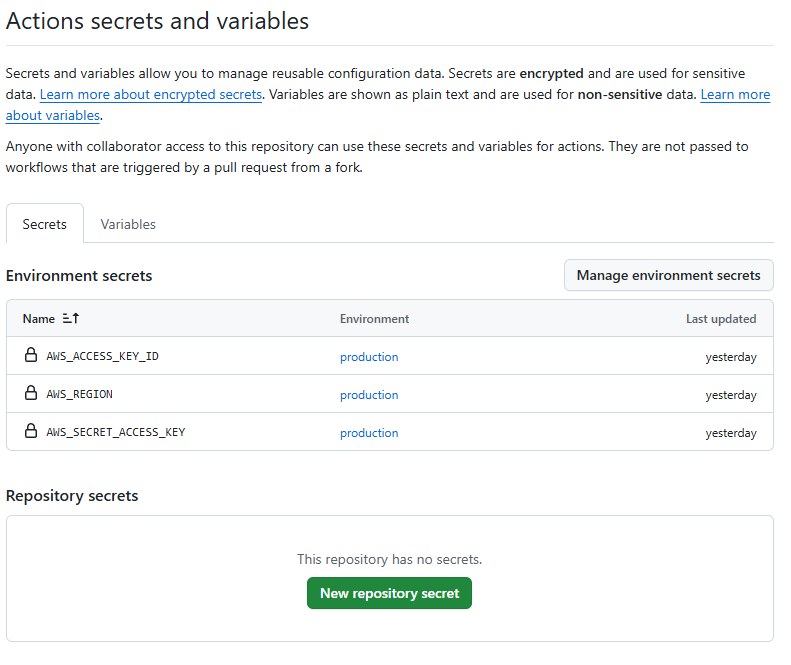

# AWS 인프라 & CI/CD 프로젝트 포트폴리오

## 개요
# 프로젝트 개요

해당 프로젝트는 Terraform과 ArgoCD를 활용하여 클라우드 환경에서 Kubernetes(EKS) 기반 인프라를 자동으로 구축하고, CI/CD 및 모니터링까지 통합 관리하는 프로젝트입니다.

Infrastructure as Code(IaC)를 통하여 인프라를 코드 형식으로 관리하며 자동화를 통하여 인프라를 배포합니다. GitOps 기반 관리릂통하여 배포 및 업데이트 과정의 투명성 확보하며 버전 관리 용이해집니다.Grafana와 Prometheus를 통해 쿠버네티스 내의 서비스 상태와 성능을 실시간으로 모니터링하며 CI/CD 파이프라인을 통해 개발자가 Git에 Push 하면 GitHub Actions가 이미지를 빌드 후 ECR에 Push 및 감지를 통해 실시간으로 변동 사항을 감지하여 언제나 최산화된 설정을 유지할 수 있습니다.

해당 프로젝트는 전체 자동화 구성이 아니기에 반드시 Read.me을 참고하여 Argocd 및 기타 리소스에 대한 설정을 하셔야 합니다.

  
**디렉토리 구성 요소**
- **Web_app_CI_CD/** : nginx을 기반 Deployment로 argocd와 연동하여 CI|CD 파이프라인으로 구축되는 디렉토리
- **ingress/** : ALB와 연동하여 사용하는 Argocd와 Monitoring의 Ingress 
- **kube-prometheus-stack/** : Helm 기반의 prometheus-stack
- **terraform_project/** : VPC 및 라우팅 구성과 eks기반 클러스터 `Terraform Code`

  

## 주요 구성 절차

### 1. Terraform 실행 
- VPC, 서브넷, 라우팅 등 기본 네트워크 환경과 EKS 클러스터를 Terraform 코드 기반으로 자동 배포 
 

### 2. ALB-Controller & EBS-CSI-Driver
**2.1 ALB-Controller 설치**
 - 정책 및 역할 생성
 - 서비스 어카운트 생성

**2.2 EBS-CSI-Driver**
 - 정책 및 역할 생성
 - 추가 기능을 활용하여 EBS-CSI-Driver 설치
 

### 3. CI|CD 파이프 라인 구축 
**3.1 git repo 생성 및 설정**
- repo 생성
- AWS Access_key 및 기타 Secret 정보 등록
 - Dockerfile 생성 및 디렉토리 구성
- Action Workflow 생성

**3.2 ECR repository 생성**
- repository 생성

**3.3 Argocd 설치**
- helm을 통한 argocd 설치
- ingress 연결
- Https 비활성화 진행 
- git repository와 연결 
- APPlication 등록

 

### 4. Monitoring 
- helm을 통한 Grafana, Promethus, AlertManager 설치
- ingress 연결 
  
  

## 1. Terraform을 사용하여 인프라 배포

<pre>
 yun@YUN:~/eks_project/terraform_project$ cd env/prod/
 yun@YUN:~/eks_project/terraform_project$ terraform init 
 yun@YUN:~/eks_project/terraform_project$ terraform plan 
 yun@YUN:~/eks_project/terraform_project$ terraform apply </pre>

  

## 2. ALB-Controller & EBS-CSI-Driver
### 2.1 ALB-Controller 설치
**[DNS 연]**
<pre>aws eks --region ap-northeast-2 update-kubeconfig --name $Cluster </pre>
 

**[ALB Controller용 IAM Policy 생성]**
<pre>curl -O https://raw.githubusercontent.com/kubernetes-sigs/aws-load-balancer-controller/v2.14.1/docs/install/iam_policy.json

aws iam create-policy \
  --policy-name AWSLoadBalancerControllerIAMPolicy \
  --policy-document file://iam_policy.json </pre>
 

**[IAM ServiceAccount 생성]**
<pre>eksctl utils associate-iam-oidc-provider --cluster $Cluster --approve

eksctl create iamserviceaccount \
  --cluster=$Cluster \
  --namespace=kube-system \
  --name=aws-load-balancer-controller \
  --role-name AmazonEKSLoadBalancerControllerRole \
  --attach-policy-arn=arn:aws:iam::$Account:policy/AWSLoadBalancerControllerIAMPolicy \
  --approve</pre>
 
  
**[생성 확인]**
<pre>kubectl get sa aws-load-balancer-controller -n kube-system -o yaml | grep role-arn</pre>
 

**[AWS-Controller 설치]**
<pre>helm repo add eks https://aws.github.io/eks-charts
helm repo update

helm install aws-load-balancer-controller eks/aws-load-balancer-controller \
  -n kube-system \
  --set clusterName=$Cluster \
  --set serviceAccount.create=false \
  --set serviceAccount.name=aws-load-balancer-controller \
  --set region=ap-northeast-2 \
  --set vpcId=$(aws eks describe-cluster --name $Cluster --query "cluster.resourcesVpcConfig.vpcId" --output text)
</pre>
  

### 2.2 EBS-CSI-Driver 설치
**[IAM Role 생성]**

  

**[신뢰 관계 정책 수정]**

<pre>aud": "sts.amazonaws.com" 
# 위와 같이 써있는 곳을 찾아 아래와 같이 수정을 한다

sub": "system:serviceaccount:kube-system:ebs-csi-controller-sa"</pre>

 
  

**[EBS-CSI-Driver 설치]**

---
  
## 3. CI|CD 파이프라인 등록
### 3.1 git repository 생성 및 설정

**[repository 추가]**
- 본인의 github 계정에서 프로젝트로 사용할 repository를 생성합니다.
- repodsitory 내의 **파일이 없는 경우** Argocd에서 인식할 수 없기에 반드시 먼저 `git pull` 한 프로젝트를 다시 본인 계정의 repo로 `git push` 하셔야 합니다.
 

**[Secret 추가]**

- GitHub Actions가 AWS에 접근해 ECR에 이미지 올리거나 클러스터를 관리하려면 AWS 인증 정보가 필요해서 Secret으로 저장한다.
 

**[Action WorkFlows 등록]**
- .github/workflow 하단의 main.yml 파일은 Action WorkFlows 파일이다.
-  github repositroy(본인의 생성한 repo) -> Action에서 `set up a workflow yourself`을 클릭하여 main.yml안에 내용을 등록한다.
-  main.yml에서 https://<argocd-url>/api/v1/applications/test/sync `<argocd-url>` 본인이 지정한 url으로 변경한다.
 

### 3.2 ECR repository 생성

- 코드가 GitHub에 올라가면 Actions가 Docker 이미지를 빌드해 ECR에 올리고, ArgoCD가 Git 레포를 감시해 Kubernetes 클러스터에 자동 배포한다.
 

### 3.2 Argocd 설치 
**[Arfocd]**
<pre>helm repo add argo https://argoproj.github.io/argo-helm
helm repo update

helm install argocd argo/argo-cd -n argocd </pre>
